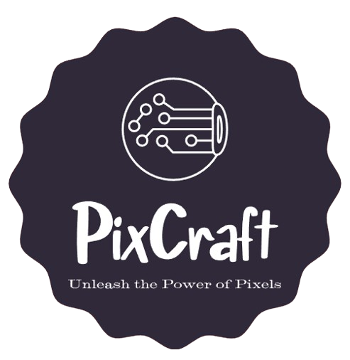

# PixCraft

[](https://opensource.org/licenses/Apache-2.0)  

 
 
 
 


---

<p align="center">
<picture>
  
</picture>
</p>

PixCraft *(Unleash the Power of Pixels)* is a powerful image processing and computer vision application that allows users to explore and manipulate digital images effortlessly. With its intuitive interface, users can upload images or access their device's camera, and then apply a wide range of image processing operations like grayscale conversion, HSV color space transformation, edge detection, and more.

Furthermore, PixCraft incorporates advanced recognition and detection techniques, including face detection, object detection, pose detection, and hand detection. These cutting-edge capabilities unlock new dimensions of image analysis and exploration, making PixCraft an invaluable tool for hobbyists, professionals, and anyone interested in the world of digital imagery. **Unleash the power of pixels** and embark on an extraordinary visual journey with PixCraft.


### Let's Start PixCrafting...

## Tech Stack:


  


## Getting Started (locally)

1. Clone the Git repository:

Use the `git clone` command followed by the repository URL to clone the repository locally:

```bash
git clone https://github.com/MeqdadDev/PixCraft.git
```

2. Navigate to the project directory:

Use the `cd` command to navigate to the directory where the cloned repository resides.

```bash
cd PixCraft
```

3. Install dependencies:

Install the dependencies by using `requirements.txt` file that lists all the necessary dependencies the application needs to run.

```bash
pip install -r requirements.txt
```

4. Run the application:

Once the dependencies are installed, you can run the Flask application using the following command:

```bash
python app.py
```

5. Access your application in the browser:

Open a web browser and navigate to:
```bash
http://localhost:5000
```

Or...

```bash
http://127.0.0.1:5000/
```
## Contributing

Pull requests are welcome. For major changes, please open an issue first to discuss what you would like to change.

Kindly try to avoid duplications, please take a sneak peek on the uploaded source code before making your PR.

### Contributors
- [Meqdad Dev (Meqdad Darwish)](https://github.com/MeqdadDev)
- We're waiting your name to be listed here :)

## License

[Apache 2.0 License](https://choosealicense.com/licenses/apache-2.0/)
