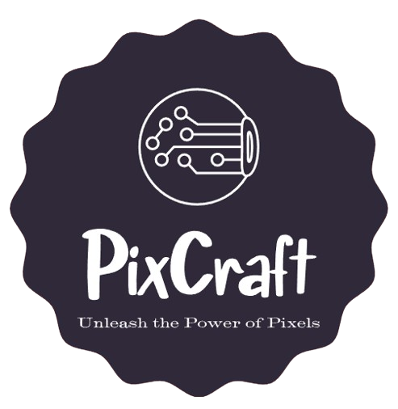

# PixCraft

  

<picture>
  
</picture>

Welcome to PixCraft *(Unleash the Power of Pixels)*, where creativity meets technology in an immersive journey of image processing excellence. With the seamless integration of Flask framework (Back-end) and OpenCV's powerful algorithms, users can upload images effortlessly and unleash a plethora of transformations with just a few clicks.

Embark on a visual odyssey as you explore edge detection, binarization, color filtering, and more, all within an intuitive and polished interface. Whether you're a seasoned artist or a curious enthusiast, PixCraft invites you to push the boundaries of digital expression and transform ordinary images into extraordinary works of art.

### Let's Start PixCrafting...

## Contributing

Pull requests are welcome. For major changes, please open an issue first to discuss what you would like to change.

Kindly try to avoid duplications, please take a sneak peek on the uploaded source code before making your PR.

### Contributors
- [Meqdad Dev (Meqdad Darwish)](https://github.com/MeqdadDev)
- We're waiting your name to be listed here :)

## License

[Apache 2.0 License](https://choosealicense.com/licenses/apache-2.0/)
